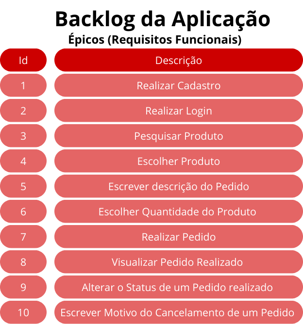
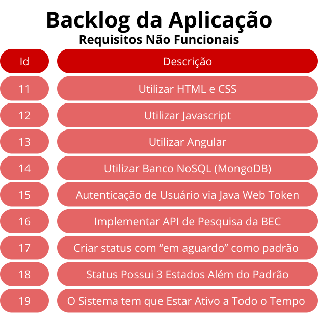
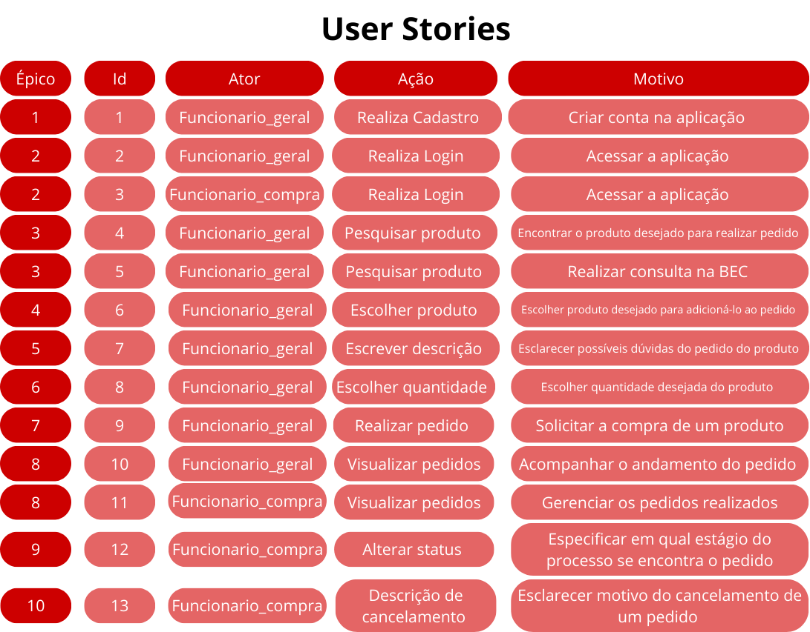

# Projeto de Compras 
 

    <a href="#sobre">Sobre</a>  |  
    <a href="#backlogs">Backlogs & User Stories</a>  |
    <a href="#prototipo">Protótipo & Documentação</a>  |  
    <a href="#tecnologias">Tecnologias</a>  |  
    <a href="#equipe">Equipe</a>  |
    <a href="#link">Link do Projeto</a>  | 
    

## :bookmark_tabs: Sobre
A partir de pedidos do administrativo da Faculdade Técnica de Votorantim, O desenvolvimento do site para facilitar o trabalho do funcionário responsável pelo trabalho de compras foi desenvolvido, consiste em um sistema de 2 frentes: a do **funcionário geral**, que pode gerar um pedido para um produto e acompanhar o andamento do pedido e o **funcionário de compras**, que visualiza pedidos realizados e os processa, mantendo o **funcionário geral** informado.

>_Projeto baseado na metodologia ágil SCRUM, procurando desenvolver a Produtividade e Colaboração entre funcionários da instituição_

Baseado em necessidades apontadas por funcionários, o usuário utilizará o sistema para armazenar dados que serão utilizados posteriormente em um novo pedido de compra, de forma que organize opções de compras e otimize tempo de pesquisa.

A partir desta ideia, o aplicativo utiliza de uma API desenvolvida para cadastrar produtos, sendo permitida a consulta, inclusão, mudança e exclusão de cada um.

:pushpin: Status do Projeto: **✔️ Concluído** 

### 🏁 Entregas de Sprints
| Sprint | Previsão | Status | Histórico |
|:--:|:----------:|:----------------|:-------------------------------------------------:|
| 01 | 20/05/2024 |  ✔️Concluído    |[ver relatório](https://github.com/paulovictorio/Documentacao_projetoCompras/blob/sprint-01/README.md)|
| 02 | 03/06/2024 |  ✔️Concluído    |[ver relatório](https://github.com/paulovictorio/Documentacao_projetoCompras/blob/sprint-02/README.md)|
| 03 | 17/06/2024 |  ✔️Concluído    |[ver relatório](https://github.com/paulovictorio/Documentacao_projetoCompras/blob/sprint-03/README.md)|

→ [Voltar ao topo](#topo)

    
## 👷 Backlogs & User Stories

    
   

   

→ [Voltar ao topo](#topo)

    
## Protótipo e Documentação
### 🏠 Protótipo 

    Com base nos dados coletados em pesquisas, foi possível montar um protótipo de alta fidelidade com o uso da ferramenta Figma. Esta ferramenta possibilitou uma visualização prévia do front-end do projeto, o suficiente para obter o alinhamento entre a equipe de desenvolvimento e o cliente. Desta forma, o projeto prototipado possui algumas funções básicas de acesso a telas e respostas a cliques em botões, posteriormente sendo funcionalidades aplicadas na própria aplicação.
    O acesso ao protótipo pode ser feito <a href="https://www.figma.com/proto/aoRbpLGfGNXeTD0hLtrsDr/Projeto-Integrador?node-id=0-1&t=P5UiG1z4EAXU1bLR-1">aqui</a>

### 📄 Documentação 
As documentações deste projeto possuem mais detalhes do planejamento e da arquitetura do software. 
Elas podem ser acessadas pelos links: [Documentação do projeto](documentacao_compras_pi.pdf)
E [Documentação ihc](ihc_compras.pdf).

> 🔗 **Links gerais**  
> - Link do sistema funcional: [clique aqui para acessar](https://projeto-mvc-restful-frontend.vercel.app)
> - Repositório do projeto: [clique aqui para acessar](https://github.com/thiago-diegoli/Projeto-MVC-RESTful)

## 🛠️ Tecnologias Utilizadas 

    

      

→ [Voltar ao topo](#topo)

## :busts_in_silhouette: Equipe

    

|    Função     |                  Nome                 |                          GitHub                              | 
| :-----------: | :-----------------------------------: | :----------------------------------------------------------: |
| Product Owner | Paulo César Ap. Q. V. Victório        ||
| Scrum Master  | Felipe Thiago da Silva                ||
| Dev Team      | Thiago Saldanha Diegoli               ||
| Dev Team      | Eduardo Brando Almeida                ||

→ [Voltar ao topo](#topo)

## Link do Projeto
    
→[Projeto de compras](https://github.com/thiago-diegoli/Projeto-MVC-RESTful)

## 🪪 Licença

The MIT License (MIT) 2024

