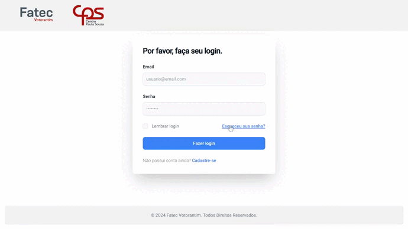

<h1 align="center">Sprint 1: 06/05/2024 a 20/05/2024</h1>

    <a href="#objetivos">Objetivos da sprint</a> &nbsp |&nbsp &nbsp
    <a href="#entregas">Entregas</a> &nbsp |&nbsp &nbsp
    <a href="#links">Links úteis</a>

O desenvolvimento do site visa facilitar o trabalho do funcionário responsável pelo trabalho de compras foi desenvolvido, como um sistema de envio de solicitações de produtos e gerenciamento de solicitações. Tendo em mente o MVC, o primeiro sprint teve como objetivo desenvolver o cadastro e login de usuários, além de realizar a implementação inicial do Web Services de busca da Bolsa Eletrônica de Compras (BEC), utilizada para a pesquisa de produtos e integrada ao projeto com o objetivo de ajudar na exatidão dos pedidos realizados. Para isso, foram levantados e validados os requisitos e o protótipo, construindo serviços e interfaces visando uma entrega de grande valor condizente com a dor do cliente.

## :dart: Objetivos da Sprint

Os requisitos (tanto do funcionário de compras como do semestre) abrangidos por essa sprint são:
- **RF 01:** Realizar cadastro
- **RF 02:** Login do usuário
- **RF 03:** Pesquisa de produtos pelo Web Service da BEC
- **RNF 12:** Utilizar HTML e CSS
- **RNF 13:** Utilizar JavaScript
- **RNF 14:** Utilizar Angular
- **RNF 15:** Utilizar banco NoSQL
- **RNF 16:** Autenticação de Usuário via JWT
- **RNF 17:** Implementar Web Service de pesquisa da BEC

## :heavy_check_mark: Entregas

Para entregas da sprint, tivemos os artefatos SCRUM validados, como Backlog do Produto, Backlog das Sprints e User Stories, através de comunicação direta entre o P.O. e o cliente.

Para extrair e entender os desejos do cliente, foi construído um protótipo inicial no Figma, criando a identidade visual e design do sistema e apresentando para validação com o cliente, onde o resultado deste protótipo, escrito utilizando Angular e com a integração das funcionalidades acordadas para a primeira sprint pode ser observado a seguir:

Este protótipo valida a entrega dos requisitos confirmados para a sprint, onde suas descrições podem ser checadas a seguir:

### RF 01 e RF 02: Realizar cadastro e login de usuário

Este requisito se trata do cadastro e login de usuários, apenas os funcionários gerais realizam o cadastro, como descrito no caso de uso. Ambos os usuários realizarão login, porém terão telas especificas, por exemplo: 
- **Funcionário geral** tem uma página com a opção de realizar pesquisas com a web service da BEC, opção de quantidade e discrição do pedido.
- **Funcionário diretor de serviços administrativos** tem uma página com o histórico dos pedidos realizados e um filtro para realizar pesquisas especificas.

### RF 03: Pesquisa de produtos pela web service da BEC

Este requisito se trata da pesquisa de produtos por uma web service conectada a bolsa eletrônica de compras, que retornara os produtos pesquisados e a natureza do produto em questão e seu id para adicioná-lo a um pedido.

   
Diagrama de classes

   <h4>Diagrama de classes mapeado do frontend</h4>
   
">

→ [Voltar ao topo](#topo)

    
## :chart_with_upwards_trend: Métricas do time
Para o melhor aproveitamento das habilidades de cada membro, o desenvolvimento foi dividido entre duas frentes: desenvolvimento front-end/back-end e protótipos/documentação, o time de prototipagem e documentação realizou o planejamento do projeto, prototipação do front end e documentação da sprint, enquanto o time de desenvolvimento realizou a programação do front-end, integração das funcionalidades, além da criação dos microsserviços necessários, integridade do código e desenvolvimento das funcionalidades do banco de dados.

- O acompanhamento de atividades, de responsabilidade do Scrum Master, se encontra na imagem adiante, que contém o gráfico Burndown gerado pela equipe (onde o eixo X são os dias trabalhados no sprint e os valores do eixo Y representam as entregas e esforços realizados com o passar do tempo).

![Burndown Chart]

## :link: Links úteis

→[Voltar ao principal](https://github.com/paulovictorio/Documentacao_projetoCompras/blob/main/README.md)
