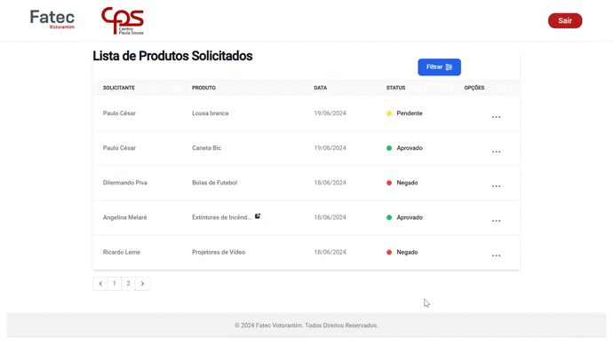

<h1 align="center">Sprint 3: 03/06/2024 a 17/06/2024</h1>

    <a href="#objetivos">Objetivos da sprint</a> &nbsp |&nbsp &nbsp
    <a href="#entregas">Entregas</a> &nbsp |&nbsp &nbsp
    <a href="#links">Links úteis</a>

Na última sprint o objetivo foi finalizar o sistema de status de pedidos no ambiente do diretor de serviços administrativos, permitindo sua utilização e usabilidade, atendendo os pedidos do cliente.

## :dart: Objetivos da Sprint

Os requisitos abrangidos por essa sprint são:
- **RF 10:** Alterar status de um pedido realizado
- **RF 11:** Escrever descrição do cancelamento de um pedido
- **RNF 21:** Status possui 2 estados além do padrão
- **RNF 22:** O sistema tem que estar ativo a todo o momento

## :heavy_check_mark: Entregas

### RF 10 : Alterar status de um pedido realizado

Este requisito tem como objetivo criar um dado informativo para histórico e para feedback do segmento dos pedidos para os funcionários da instituição.

- **Funcionário diretor de serviços administrativos** pode alterar os status para manter o funcionário que realizou o pedido informado.
- **Funcionário Geral** pode vizualizar a mudança para se informar do status de seu pedido.

### RF 11 : Escrever descrição do cancelamento de um pedido

Este requisito se refere ao caso do funcionário diretor de serviços administrativos desejar cancelar um pedido, uma justificativa será preenchida para esclarecer possíveis dúvidas sobre o cancelamento do pedido.

- **Funcionário diretor de serviços administrativos** escreve em detalhes o motivo de cancelamento de um pedido.
- **Funcionário Geral** vizualiza a justificativa e se informa do motivo do cancelamento de seu pedido.

   
Diagrama de classes

   <h4>Diagrama de classes mapeado do frontend</h4>
    
   
    

→ [Voltar ao topo](#topo)
    

## :link: Links úteis

- Repositório do projeto: [Projeto de compras](https://github.com/thiago-diegoli/Projeto-MVC-RESTful)
- Site do projeto: [https://projeto-mvc-restful-frontend.vercel.app](https://projeto-mvc-restful-frontend.vercel.app) (usuário exemplo - email: `usuario@email.com`, senha: `senha123`)
- Voltar ao [documento principal](https://github.com/paulovictorio/Documentacao_projetoCompras/blob/main/README.md)
